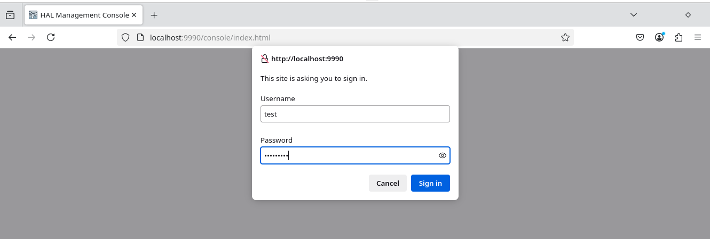
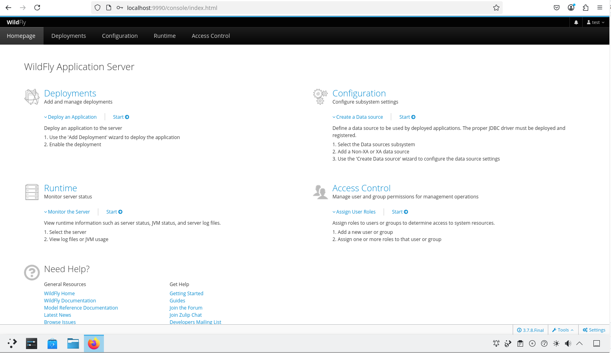

# 第 16.5 节 WildFly

## 安装 WildFly

>**注意**
>
>可以自行通过 Ports 获取 WildFly 历史版本，但是有 Bug [java/wildfly: service start fail, illegal group name](https://bugs.freebsd.org/bugzilla/show_bug.cgi?id=285956)，历史版本需要自己打下补丁。

- 使用 pkg 安装：

```sh
# pkg install wildfly
```

- 使用 ports 安装：

```sh
# cd /usr/ports/java/wildfly/ 
# make install clean
```

## 查看 WildFly 安装后说明

```sh
# wildfly-35.0.1:
# 安装说明如下：

# On install:
# 安装时：

# To make WildFly bind to all interfaces add this to rc.conf:
# 若要使 WildFly 绑定到所有网络接口，在 rc.conf 中添加以下内容：

# wildfly_args="-Djboss.bind.address=0.0.0.0"

# See
# 参见

# https://community.jboss.org/wiki/JBossProperties
# https://community.jboss.org/wiki/JBossProperties

# for additional startup properties.
# 以获取更多启动参数说明。

# To change JVM args, edit appropriate standalone.conf.
# 若要修改 JVM 参数，请编辑相应的 standalone.conf 文件。

# To add the initial admin user:
# 若要添加初始管理员用户：

# /usr/local/wildfly/bin/add-user.sh
```

## 配置 Wildfly

设置 RC：

```sh
# service wildfly enable
# sysrc wildfly_args="-Djboss.bind.address=0.0.0.0 -Djboss.bind.address.management=0.0.0.0"
```

- 然后启动服务：

```sh
# service wildfly start
```

- 打开 `http://127.0.0.1:8080`（对应的局域网也可以连接）即可检验服务状态。


- 可以用 `/usr/local/wildfly/bin/add-user.sh` 生成管理员账户。

```sh
# /usr/local/wildfly/bin/add-user.sh

What type of user do you wish to add?
 a) Management User (mgmt-users.properties)
 b) Application User (application-users.properties)
(a): # 我直接回车了
# 默认 a 是管理员账户。b 是应用用户。

Enter the details of the new user to add.
Using realm 'ManagementRealm' as discovered from the existing property files.
Username : test # 输入要创建的用户名
Password recommendations are listed below. To modify these restrictions edit the add-user.properties configuration file.
 - The password should be different from the username 
# 密码不能和用户名相同
 - The password should not be one of the following restricted values {root, admin, administrator} 
# 密码不能是 root、admin 或 administrator
 - The password should contain at least 8 characters, 1 alphabetic character(s), 1 digit(s), 1 non-alphanumeric symbol(s)
#密码应至少包含 8 个字符，且最少包含 1 个字母、1 个数字、1 个非字母非数字符号。
Password : # 输入为新用户 test 设置的密码，要求见上文
Re-enter Password : # 重复输入密码
What groups do you want this user to belong to? (Please enter a comma separated list, or leave blank for none)[  ]: # 我直接回车了
# 你希望该用户属于哪些用户组？（请输入以逗号分隔的列表，或留空表示不加入任何用户组）[  ]：
About to add user 'test' for realm 'ManagementRealm'
# 即将为域 'ManagementRealm' 添加用户 'test'。
Is this correct yes/no? yes # 确认创建
Added user 'test' to file '/usr/local/wildfly/standalone/configuration/mgmt-users.properties'
Added user 'test' to file '/usr/local/wildfly/domain/configuration/mgmt-users.properties'
Added user 'test' with groups  to file '/usr/local/wildfly/standalone/configuration/mgmt-groups.properties'
Added user 'test' with groups  to file '/usr/local/wildfly/domain/configuration/mgmt-groups.properties'
```

- 打开 `http://localhost:9990`（对应的局域网也可以连接，例如我是 `http://192.168.179.150:9990/`）即可登录管理界面。







## 故障排除与未竟事宜

- 如果服务无法正常启动，可以通过 `/var/log/wildfly/error`、`/var/log/wildfly/log` 查看错误日志。

- WildFly GUI 界面不知道怎么设置中文

待解决
